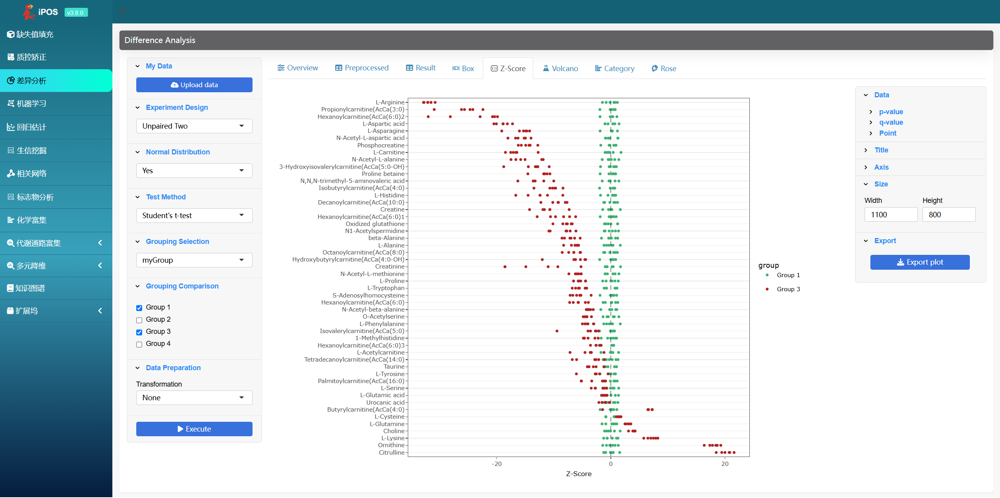

## Introduction

### Home

### Difference Analysis

The `difference analysis` module provides the following algorithms:

- Welch's t-test
- Student's t-test
- Mann-Whitney U test

- Kolmogorov-Smirnov test
- Paired t-test
- Wilcoxon singed-rank test
- One-way ANOVA
- Welch's ANOVA
- Kruskal-Wallis test

The running results of the algorithms are presented in various visualization charts:

- Table

  

- Z-Score plot

  

- rose plot

  

- Volcano plot

  

- Box plot

  

### Dimension Reduction

The `dimension reduction` module provides the following algorithms:

- PCA
- OPLS

In addition, the following data preprocessing methods are also provided:

- Log2 transformation
- Log10 transformation
- Centering scaling
- Unit-Variance scaling
- Pareto scaling
- Range scaling
- Vast scaling
- Level scaling

The running results of the algorithms are presented in various visualization charts:

- S-plot

  

- VIP plot

  

- Scree plot

  

- Loading plot

  

- Bi-plot

  

- Score plot

  

### Missing Value Imputation

The `missing value imputation` module provides the following algorithms:

- Zero
- Half Minimum
- Median
- Mean
- Minimum
- KNN
- Random Forest
- SVD
- PPCA
- QRILC

The running results of the algorithms are presented in various visualization charts:

- Table

  

- Charts

  

  

### Machine Learning

The `machine learning` module provides the following algorithms:

- Random Forest
- SVM-RFE

### Regression Analysis

The `regression analysis` module provides the following algorithms:

- LASSO

- Elastic-Net

### Pathway Gallery

This module collects thousands of research papers and pathway pictures from high-impact-factor journals about metabolomics, which can help you quickly retrieve disease-related pathways and directly access important literatures.

Tencent Cloud trial version：http://82.157.20.231:3838/ipos