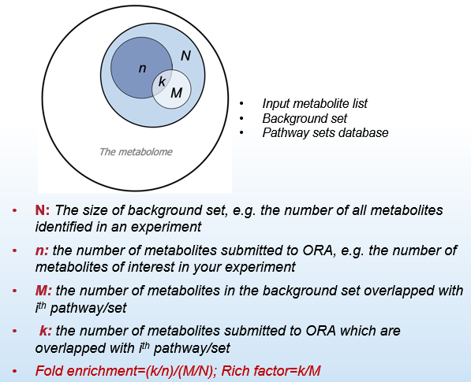
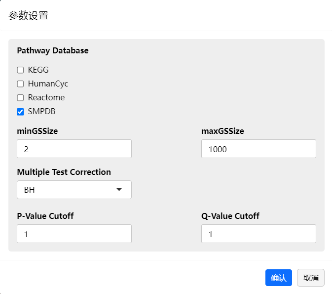
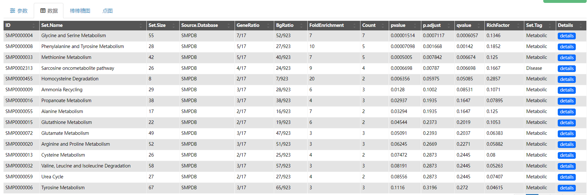

### 数据库介绍

**代谢通路富集** 模块使用的代谢集数据库 Metabolite Sets Database，即代谢物有关的新陈代谢通路和生物学功能知识文库，来源于 KEGG, SMPDB, Reactome 与 HumanCyc。数据库版本、集的规模等信息，详见富集分析结果表。

#### 

#### KEGG: Kyoto Encyclopedia of Genes and Genomes[1]

- **网站链接**：[https://www.genome.jp/kegg/](https://www.genome.jp/kegg/)

- v 数据库简介：KEGG是国际上最知名的系统生物学与分子生物学知识文库之一。项目始于1995年，由 Minoru Kanehisa 教授领导，目前由 Bioinformatics Center, Institute for Chemical Research, Kyoto University 和Human Genome Center, Institute of Medical Science, University of Tokyo 联合开发维护。KEGG is a database resource for understanding high-level functions and utilities of the biological system, such as the cell, the organism and the ecosystem, from molecular-level information, especially large-scale molecular datasets generated by genome sequencing and other high-throughput experimental technologies.

- **生物信息的实质是分子间的互作、反应和关联**。**KEGG Pathway** is a collection of manually drawn pathway maps representing our knowledge of the molecular interaction, reaction and relation network for: **Metabolism, Genetic information, Environmental information processing, Cellular processes, Organismal systems, Human diseases, Drug development.**

  

#### 

#### SMPDB: Small Molecule Pathway Database[2]

- **网站链接**：[http://www.smpdb.ca/](http://www.smpdb.ca/)
- 数据库简介：SMPDB是国际知名代谢组学数据库HMDB的姊妹库。项目始创于2009年，由加拿大阿尔伯塔大学Departments of Computing Science & Biological Sciences的Dr. David Wishart教授团队负责开发维护。
- SMPDB is an interactive, visual database containing more than 40000 machine readable pathways found in model organisms such as *Humans, Mice, E. coli, Yeast*, and *Arabidopsis thaliana*. The majority of these pathways are not found in any other pathway database. SMPDB is designed specifically to support pathway elucidation and pathway discovery in metabolomics, transcriptomics, proteomics, and systems biology. 
- v **Pathway types of SMPDB** are classified into six categories, including **Metabolic, Physiological, Signaling, Drug metabolism, Drug action, Disease.** 

#### 

#### Reactome[3]

- **网站链接**：[https://reactome.org/](https://reactome.org/)
- 数据库简介：Reactome 项目始于2003年，由美国国立卫生研究院NIH与欧洲分子生物学实验室EMBL联合资助，一个国际多学科团队负责开发维护，团队主要成员来自 Ontario Institute for Cancer Research, EMBL-EBI, Oregon Health & Science University, New York University Langone Medical Center 等机构。
- Reactome is a free, open-source, curated and peer-reviewed pathway database. Our goal is to provide intuitive bioinformatics tools for the visualization, interpretation and analysis of pathway knowledge to support basic research, genome analysis, modeling, systems biology and education. The cornerstone of Reactome is a freely available, open source relational database of signaling and metabolic molecules and their relations organized into biological pathways and processes.
- Biological pathways in Reactome include **Classical intermediary metabolism, Signaling, Transcriptional regulation, Apoptosis** and **Disease**.

#### 

#### HumanCyc: Encyclopedia of Human Genes and Metabolism[4]

- **网站链接**：[https://humancyc.org/](https://humancyc.org/)
- 数据库简介：HumanCyc是BioCyc数据库家族的一个成员，其突出特色在于以pathway/genome database (PGDB)的信息组织形式提供了有关人体基因组及基因产物催化的新陈代谢反应与代谢产物的丰富知识。BioCyc由美国一家非盈利性研究机构SRI International旗下的人工智能中心负责开发，开发小组由Dr. Peter Karp领导，项目也受NIH资助。BioCyc旨在通过开发集成广泛数据和知识的高质量生物数据库，以及用于搜索、分析和可视化这些数据库的简易软件工具来加速科学进步。HumanCyc只提供一定次数的免费试用，长期使用需要付费订阅。
- HumanCyc provides an encyclopedic reference on human metabolic pathways, the human genome, and human metabolites. HumanCyc is part of the larger BioCyc collection of thousands of Pathway/Genome Databases for sequenced genomes. 

---

### 富集分析的背景知识

- **代谢集数据库的编辑与构建：**参考Ralf Herwig等人发表在2016年《Nature Protocols》上Consensus PathDB整合数据库的设计思路[5]，我们精心选择了四种最主流、最专业且最具有行业代表性的代谢相关生物化学与分子生物知识文库：KEGG, SMPDB, Reactome, HumanCyc，并按照“互补而不冗余”的原则对最新版数据库进行了重编辑，形成了行业内最为全面的代谢集数据库 metabolites sets database，这将有力地弥补现有路径下使用 MetaboAnalyst 只能被动使用 KEGG/SMPDB 过期数据库而造成的富集分析不全面、数据浪费的不足，从而获得更具有生物学启发性的富集结果，使优质的代谢组学测量数据与深度的功能研究二者相得益彰。

- **代谢集数据库的使用：**建议研究者根据需要选择使用全部或部分数据库进行富集分析。概括而言，KEGG、HumanCyc、SMPDB 数据库收录的代谢集以Metabolism（人体内源性新陈代谢）为主，SMPDB 尤其是记录了大量遗传性代谢病等异常代谢通路，而 Reactome 数据库除了基础的新陈代谢代谢通路之外，尚包含非常丰富多样的、小分子代谢物参与的信号通路等生物化学与分子生物学信息。

- **富集分析**/**通路分析**：在中文语境下，代谢通路分析（Metabolic Pathway Analysis）与代谢物富集分析（Metabolite Enrichment Analysis）往往异曲同工。其目的都是解读并发现所关注的一组代谢物背后关联的通路知识，而通路代表的是参与特定生物功能或生化反应的多个分子的集合，即所谓代谢物集（概念源自基因集Geneset）。这些代谢物集来源于生物学数据库，是对代谢物相关的现有已知生物学知识的系统归纳，由专家人工汇编、定义、整理而成。目前富集分析/通路分析主要有两种实现形式：过表达分析（ORA, Over Representation Analysis）和基因集富集分析（GSEA, Gene Set Enrichment Analysis）。

- **ORA** 工作原理：a common practice for biological interpretation in high-throughput omics researches. ORA works by identifying specific pathways or metabolite sets that have a higher overlap with a list of molecules submitted to ORA than expected by chance. ORA 的数学基础是超几何分布检验Hypergeometric distribution，公式见下。又因为 ORA 同时对多个 Pathway 进行检验，因此需要对检验结果进行多重检验校正。

  

      
  

- **ORA** 工作示意图：ORA 分析所需的源数据包括 Query List, Background List 和 Pathway sets database，其分别对应的含义与实施原理见下图。

  

      
  

  值得关注的是，ORA 分析中 Background List 是必需的！如不提供 Background List，则相当于使用 Pathway sets database 中包含的全部代谢物做Background List 进行富集，得到的富集结果的显著性水平要比实际值高的多，意味着结果中有假阳性。

---

### ORA 参数设置

#### 数据格式

- 【代谢通路富集】模块导入文件格式支持 `xlsx` 和 `csv`。

- `QueryList` 数据和 `Background List` 的数据格式一致，如下图所示，是一列只包含 HMDBID 的 Dataframe，列名称任意，但不可缺省。

  

  
  

#### 参数设置

- `minGSSize` 和 `maxGSSize`：ORA 分析拟使用的 Metabolite set database 中代谢物集所包含代谢物数目的下限和上限。
- `Multiple Test Correction`：对 ORA 结果进行多重检验校正的方法。
- `P-value Cutoff` 和 `Q-value Cutoff`：用于在【数据】中展示 ORA 结果的显著性水平阈值。

#### 结果解读

- `ID`：代谢物集的源数据库编号，可直接用于源数据库检索。

- `Set Name`：代谢物集的名称。

- `Set Size`：代谢物集中包含的代谢物数目。

- `Source Database`：代谢物集的数据库来源。

- `GeneRatio, BgRatio`：送检代谢物与代谢物集的重叠结果。

- `Fold Enrichment, Rich Factor`：衡量富集度大小的量值。

- `Count`：送检代谢物与某一代谢物集的重叠代谢物的数目。

- `Set Tag`：代谢物集在源数据库中的大类别。

  

  
  

- `Candidate`：用红色字体突出的是送检代谢物与此集重叠的代谢物。

- `Description`：关于此代谢物集的背景知识简介。

---

### 参考文献

- [1] *Nucleic Acids Res.* 2021 Jan 8;49(D1):D545-D551. doi: 10.1093/nar/gkaa970.

- [2] *Nucleic Acids Res.* 2014 Jan;42(Database issue):D478-84. doi: 10.1093/nar/gkt1067.

- [3] *Nucleic Acids Res.* 2022 Jan 7;50(D1):D687-D692. doi: 10.1093/nar/gkab1028.

- [4] *Genome Biol.* 2005;6(1):R2. doi: 10.1186/gb-2004-6-1-r2.

- [5] *Nat Protoc.* 2016 Oct;11(10):1889-907. doi: 10.1038/nprot.2016.117.

- [6] *PNAS.* 2005 Oct 25;102(43):15545-50. doi: 10.1073/pnas.0506580102.

