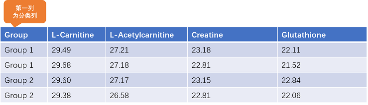
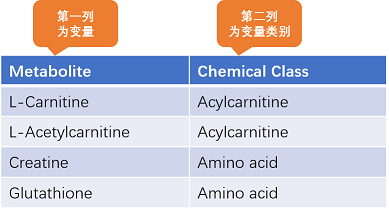
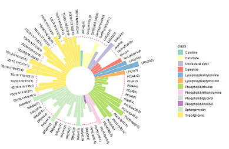
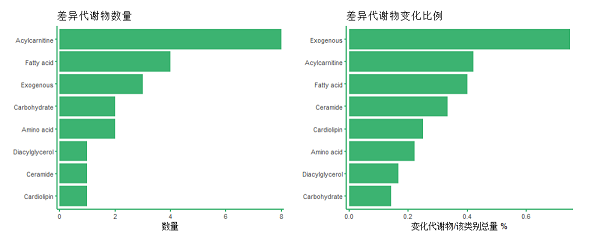

**差异分析** 模块用作分析 `分类` 数据中具有显著性表达差异的特征（变量）。数据导入格式为 `csv`。

我们约定采用 `样本 × 变量` 的格式存储数据，即数据的每一行表示一个样本，数据的每一列表示一个特征（变量）。

我们同样约定，分类数据的 `第一列` 作为标识样本的类别所属的分类列，类型为离散型，列名称可自由定义；

上传主表数据即可完成大部分的分析功能，但是个别的分析功能需要同时依赖 `主表 + 附表`。

附表中记录的是 `变量的所属类别信息`，`第一列为变量`，`第二列为变量类别`，如下图所示：

`附表中的变量顺序、个数不必和主表中的变量顺序、个数保持完全一致`，附表中只要包含主表中涉及的变量即可，顺序无关紧要。

如果有变量的类别信息未在附表中标注，则会被统一标注为 `unknown`。

差异分析模块中需要同时依赖 `主表 + 附表` 的功能点如下：

1. 环形玫瑰图

   需要依赖附表数据对不同类别的变量进行着色

   

2. 种类富集图

   需要依赖附表数据对各类别变量进行统计

   